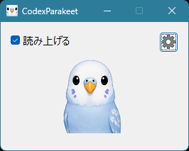

# CodexParakeet

CodexParakeet is a lightweight Windows application that converts Codex CLI responses into synthesized speech. It currently supports Japanese voice output using [VOICEVOX CORE](https://github.com/VOICEVOX/voicevox_core).

詳しい紹介とスクリーンショットは、[CodexParakeet 公式ページ](https://ktzks.github.io/CodexParakeet/)をご覧ください。

Version: **1.1.0**

## Overview

### Download

A pre-built Windows x64 package is available from the
[GitHub Releases page](../../releases).

The ZIP contains the pre-built application. VOICEVOX CORE is not included;
follow the installation instructions below before using the application.

### Features and current limitations

- Japanese is currently the only supported language. Sorry for the limitation.
- The application uses spatial audio. On systems that provide terminal/window position information, speech is played as if it came from the corresponding on-screen location.
- The available speech voices are **WhiteCUL**, **春日部つむぎ**, and **ずんだもん**.

### Screenshot



## Installation

### 1. Extract the Release ZIP

Download `CodexParakeet-vXX.zip` from the Releases page and
extract it to a temporary location.
[GitHub Releases page](../../releases).

Rename the extracted folder to `CodexParakeet` if necessary.

### 2. Obtain and place VOICEVOX CORE

Download **VOICEVOX CORE 0.17.0 for Windows x64** from the [VOICEVOX CORE release
page](https://github.com/VOICEVOX/voicevox_core/releases/tag/0.17.0).

Extract the contents of the VOICEVOX CORE archive into the
`voicevox_core/` folder inside the extracted `CodexParakeet` folder.

```text
CodexParakeet\
├─ CodexParakeet.exe
├─ codex_speak_notify.ps1
├─ lipsync/
├─ voicevox_core/
│  ├─ c_api/
│  │  ├─ include/
│  │  └─ lib/
│  ├─ dict/
│  │  └─ open_jtalk_dic_utf_8-1.11/
│  ├─ models/
│  │  └─ vvms/
│  └─ onnxruntime/
│     └─ lib/
└─ voicevox_core.dll
```

Copy `voicevox_core.dll` to the same directory as `CodexParakeet.exe`.

### 3. Copy the CodexParakeet folder locally

Copy the complete `CodexParakeet` folder to a local folder such as:

```text
C:\Program Files\CodexParakeet
```

### 4. Configure Codex CLI

Configure the Codex notification hook in `config.toml`. `notify` must be defined at the **top level** of the file. Do not put it below a section such as `[xxx]`; a section-scoped `notify` setting will not configure the top-level notification hook.

Set the path to the `codex_speak_notify.ps1` file in the runtime directory you installed:

```toml
notify = ["powershell.exe", "-NoProfile", "-ExecutionPolicy", "Bypass", "-File", "C:\\Program Files\\CodexParakeet\\codex_speak_notify.ps1"]
```

Replace the example path with the actual path on your machine.

## Usage

Restart Codex and start a conversation. Codex's responses will then be played aloud.

## Uninstallation

CodexParakeet does not include an installer or an uninstaller. To remove it:

1. Delete the runtime folder where you placed `CodexParakeet.exe` and its related files.
2. Remove the CodexParakeet `notify` entry from `config.toml`, or restore the previous `config.toml` content.
3. Delete `%LOCALAPPDATA%\CodexParakeet` to remove the saved application settings.

The application does not create Registry entries. VOICEVOX CORE files placed in
the repository's `third_party/voicevox_core/` directory are also not removed by
deleting the runtime folder; remove them separately if you no longer need them.

## Additional Information

### VOICEVOX CORE

CodexParakeet uses [VOICEVOX CORE](https://github.com/VOICEVOX/voicevox_core),
an excellent Japanese speech synthesis engine. VOICEVOX CORE is not included
in the CodexParakeet release package.

Please review and comply with the licenses and usage terms of VOICEVOX CORE and its voice models.

### Verified environment

CodexParakeet has been verified in the following environment:

- Windows 11
- The ChatGPT Codex app: [Introducing the Codex app](https://openai.com/ja-JP/index/introducing-the-codex-app/)
- [VOICEVOX CORE 0.17.0](https://github.com/VOICEVOX/voicevox_core/releases/tag/0.17.0), x64 Windows release
- Visual Studio 2026

Other versions may work, but have not been verified by the author.

## Building the Application

If you want to build `CodexParakeet.exe` yourself, follow the steps below.

1. Obtain the x64 Windows release of VOICEVOX CORE 0.17.0.
2. Place it under `third_party/voicevox_core/`.
3. Open `app_src/CodexParakeet.slnx` in Visual Studio 2026.
4. Build the `Release` configuration for `x64`.
5. Run `scripts/Initialize-Runtime.ps1` to assemble the runtime directory.

For example:

```powershell
powershell.exe -ExecutionPolicy Bypass -File .\scripts\Initialize-Runtime.ps1 `
  -RuntimeRoot C:\Work\CodexParakeet
```

The build requires the VOICEVOX CORE files locally, but those files are not
committed to this repository.
